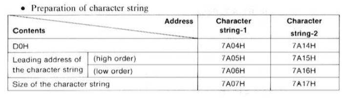
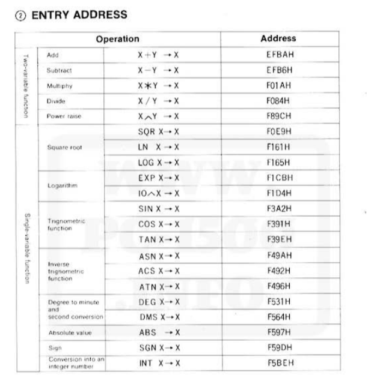

# BASIC Commands and Memory Address

### BASIC Command List:

| Command    | Internal Code | Description                                  |
| ---------- | ------------- | -------------------------------------------- |
| `ABS`      | F170H         | Returns absolute value of a number           |
| `ACS`      | F174H         | Arc cosine function                          |
| `AND`      | F150H         | Logical AND operation                        |
| `AREAD`    | F18OH         | Reads analog input                           |
| `ARUN`     | F181H         | Auto-run a program                           |
| `ASC`      | F160H         | Returns ASCII code of a character            |
| `ASN`      | F173H         | Arc sine function                            |
| `ATN`      | F175H         | Arc tangent function                         |
| `BEEP`     | F182H         | Produces a sound from the device speaker     |
| `BREAK`    | F0B3H         | Interrupts program execution                 |
| `CALL`     | F18AH         | Calls a machine language subroutine          |
| `CHAIN`    | F0B2H         | Links to another program                     |
| `CHR$`     | F163H         | Converts ASCII code to character             |
| `CLEAR`    | F187H         | Clears variables and resets memory           |
| `CLOAD`    | F089H         | Loads program from tape                      |
| `CLS`      | F088H         | Clears the display                           |
| `COM$`     | F858H         | Communicates via serial port                 |
| `CONSOLE`  | F0B1H         | Switches to console mode                     |
| `CONT`     | F183H         | Continues from a `STOP` or `BREAK`           |
| `COLOR`    | F0B5H         | Sets display text color                      |
| `COS`      | F17EH         | Cosine function                              |
| `CSAVE`    | F095H         | Saves program to tape                        |
| `CSIZE`    | E680H         | Sets character size for printing             |
| `CURSOR`   | F084H         | Positions cursor                             |
| `DATA`     | F18DH         | Holds data for `READ` statements             |
| `DEF`      | F165H         | Defines a function                           |
| `DEGREE`   | F18CH         | Sets angle mode to degrees                   |
| `DEV$`     | E857H         | Device name for serial communication         |
| `DIM`      | F179H         | Declares an array with specified dimensions  |
| `DMS`      | F166H         | Degree-minute-second (DMS) conversion        |
| `DTE`      | E884H         | Date function                                |
| `END`      | F19EH         | Marks end of program                         |
| `ERL`      | F053H         | Returns line number of error                 |
| `ERN`      | F052H         | Returns error number                         |
| `ERROR`    | F1B4H         | Error handling function                      |
| `EXP`      | F176H         | Calculates e^x                               |
| `FEED`     | F0B0H         | Paper feed on printer                        |
| `FOR`      | F1A5H         | Begins a FOR loop                            |
| `GCURSOR`  | F093H         | Graphics cursor control                      |
| `GLCURSOR` | E682H         | Lower graphics cursor control                |
| `GOSUB`    | F194H         | Jumps to subroutine, returning with `RETURN` |
| `GOTO`     | F192H         | Unconditional jump to a line number          |
| `GPRINT`   | F09F          | Graphics print                               |
| `GRAD`     | F186H         | Sets angle mode to gradients                 |
| `GRAPH`    | E681H         | Switches to graphics mode                    |
| `IF`       | F196H         | Conditional branching                        |
| `INKEY$`   | F15CH         | Returns last pressed key                     |
| `INPUT`    | F091H         | Takes input from the user                    |
| `INSTAT`   | E859F         | Checks input status                          |
| `INT`      | F171H         | Converts to integer                          |
| `LCURSOR`  | E683H         | Lower cursor control                         |
| `LEFT$`    | F17AH         | Returns left substring                       |
| `LEN`      | F164H         | Returns length of a string                   |
| `LET`      | F198H         | Assigns a value to a variable                |
| `LF`       | F0B6H         | Line feed                                    |
| `LINE`     | F0B7H         | Draws line in graphics mode                  |
| `LIST`     | F090H         | Displays program code                        |
| `LLIST`    | F0B8H         | List program to printer                      |
| `LN`       | F176H         | Natural logarithm                            |
| `LOCK`     | F1B5H         | Locks program for editing                    |
| `LOG`      | F177H         | Natural Logarithmic function                 |
| `LPRINT`   | F0B9H         | Print to line printer                        |
| `MEM`      | F158H         | Displays memory usage                        |
| `MERGE`    | F08FH         | Merges another program into current program  |
| `MID$`     | F17BH         | Extracts a substring                         |
| `NEW`      | F19BH         | Clears program and data areas                |
| `NEXT`     | F19AH         | Ends a FOR loop                              |
| `NOT`      | F16DH         | Logical NOT                                  |
| `OFF`      | F19EH         | Turns off power (optional in certain models) |
| `ON`       | F19CH         | Handles events based on specific conditions  |
| `OPN`      | F19DH         | Opens file for I/O                           |
| `OR`       | F151H         | Logical OR                                   |
| `OUTSTAT`  | E880H         | Checks output status                         |
| `PAUSE`    | F1A2H         | Pauses program execution                     |
| `PEEK`     | F16FH         | Reads data from a memory address             |
| `PEEK#`    | F16EH         | Extended peek for memory data                |
| `PI`       | F15DH         | Returns value of Pi                          |
| `POINT`    | F168H         | Returns graphics point color                 |
| `POKE`     | F1A1H         | Writes data to a memory address              |
| `POKE#`    | F1A0H         | Extended poke for memory data                |
| `PRINT`    | F097H         | Displays text on screen                      |
| `RADIAN`   | F1AAH         | Sets angle mode to radians                   |
| `RANDOM`   | F1A8H         | Returns a random number                      |
| `READ`     | F1A6H         | Reads data from DATA statements              |
| `REM`      | F1ABH         | Comment statement                            |
| `RESTORE`  | F1A7H         | Resets DATA pointer                          |
| `RETURN`   | F199H         | Returns from subroutine                      |
| `RIGHT$`   | F172H         | Returns right substring                      |
| `RINKEY$`  | E85AH         | Reads last input key                         |
| `RLINE`    | F0BAH         | Reads a line from printer                    |
| `RMT`      | E7A9H         | Remote command for communication             |
| `RND`      | F17CH         | Returns a random number (`RANDOM`?)          |
| `ROTATE`   | E685H         | Rotates graphics display                     |
| `RUN`      | F1A4H         | Starts program execution                     |
| `SETCOM`   | E882H         | Sets communication mode                      |
| `SETDEV`   | E886          | Sets device configuration                    |
| `SGN`      | F179H         | Returns sign of a number                     |
| `SIN`      | F17DH         | Sine function                                |
| `SORGN`    | E684H         | Sets origin for graphics                     |
| `SPAVCE$`  | F061H         | Returns a string of spaces                   |
| `SQR`      | F16BH         | Returns the square root of a number          |
| `STATUS`   | F167H         | Displays status information                  |
| `STEP`     | F1ADH         | Specifies increment in FOR loop              |
| `STOP`     | F1ACH         | Pauses program                               |
| `STR$`     | F161H         | Converts a number to a string                |
| `TAB`      | F0BBH         | Moves cursor to specified position           |
| `TAN`      | F17FH         | Tangent function                             |
| `TERMINAL` | E883H         | Switches to terminal mode                    |
| `TEST`     | F0BCH         | Tests condition in program                   |
| `TEXT`     | E686H         | Switches to text mode                        |
| `THEN`     | F1AEH         | Specifies action if condition in `IF` is met |
| `TIME`     | F15BH         | Returns current time                         |
| `TO`       | F1B1H         | Specifies range in `FOR` loop                |
| `TRANSMIT` | E885H         | Transfers data via serial                    |
| `TROFF`    | F1B0H         | Turns trace off                              |
| `TRON`     | F1AFH         | Turns trace on                               |
| `UNLOCK`   | F1B6H         | Unlocks program for editing                  |
| `USING`    | F086H         | Formats output                               |
| `VAL`      | F162H         | Converts string to a numeric value           |
| `WAIT`     | F1B3H         | Pauses execution until condition met         |
| `ZONE`     | F0B4H         | Sets tabulation zone for printing            |

### System Subroutines List

## 1. Character Functions

| Name                      | Memory Address | Description                                                                       |
| ------------------------- | -------------- | --------------------------------------------------------------------------------- |
| Combination of Characters | D925H          | Combines multiple characters into a single string                                 |
| CHR$                      | D9B1H          | Converts an ASCII code to its corresponding character                             |
| STR$                      | D9CFH          | Converts a string representation of a number back to a numeric value              |
| VAL                       | D9D7H          | Converts a string to a numeric value                                              |
| LEN, ASC                  | D9DDH          | `LEN`: Returns the length of a string; `ASC`: Returns ASCII code of a character   |
| RIGHT$                    | D9F3H          | Extracts a specified number of characters from the right end of a string          |
| MID$                      | D9F3H          | Extracts a substring from a string, given a starting position and length          |
| LEFT$                     | D9F3H          | Extracts a specified number of characters from the left end of a string           |

---

## 2. Arithmetic Operations

| Name       | Memory Address | Description                                                                |
| ---------- | -------------- | -------------------------------------------------------------------------- |
| Subtract   | EFB6H          | Subtracts one number from another                                          |
| Add        | EFBAH          | Adds two numbers                                                           |
| Multiply   | F01AH          | Multiplies two numbers                                                     |
| Divide     | F084H          | Divides one number by another                                              |
| LN         | F161H          | Computes the natural logarithm of a number                                 |
| LOG        | F165H          | Computes the base-10 logarithm of a number                                 |
| EXP        | F1CBH          | Calculates the exponential function \(e^x\)                                |
| 10^n       | F1D4H          | Computes 10 raised to the power of a specified exponent                    |
| COS        | F391H          | Computes the cosine of an angle                                            |
| TAN        | F39EH          | Computes the tangent of an angle                                           |
| SIN        | F3A2H          | Computes the sine of an angle                                              |
| ACS        | F492H          | Computes the arc cosine (inverse cosine) of a value                        |
| ATN        | F496H          | Computes the arc tangent (inverse tangent) of a value                      |
| ASN        | F49AH          | Computes the arc sine (inverse sine) of a value                            |
| DEG        | F531H          | Converts a radian measure to degrees                                       |
| DMS        | F564H          | Converts a degree measure to degrees, minutes, and seconds                 |
| ABS        | F597H          | Computes the absolute value of a number                                    |
| SGN        | F59DH          | Returns the sign of a number (1 for positive, -1 for negative, 0 for zero) |
| INT        | F5BEH          | Returns the integer portion of a number, discarding any fractional part    |
| Power Rise | F89CH          | Raises a number to a specified power                                       |

---

## 3. Compare

| Name                        | Memory Address | Description                                                      |
| --------------------------- | -------------- | ---------------------------------------------------------------- |
| Numerical Comparison        | D0D2H          | Compares two numeric values and returns a result                 |
| Character String Comparison | D0F9H          | Compares two strings lexicographically to determine order        |

---

## 4. Search

| Name               | Memory Address | Description                                                   |
| ------------------ | -------------- | ------------------------------------------------------------- |
| Line number Search | D2EAH          | Searches for a specific line number in the program            |
| KEY Scan (1)       | E42CH          | Scans the keyboard to detect key presses; single key detection|
| KEY Scan (2)       | E243H          | Scans the keyboard for combinations                           |
| Variable Search    | D461H          | Searches for a variable by name in the program’s memory       |

---

## 5. Display

| Name                                     | Memory Address |Description|
| ---------------------------------------- | -------------- | ----------------------------------------------------- |
| Auto-power-off                           | E33FH          | Manages automatic power-off to conserve battery life  |
| Program display                          | E8CAH          | Displays the current program code on the screen       |
| Graphic Display                          | EDEFH          | Enables graphical display mode                        |
| Hexadecimal                              | ED95H          | Displays a value in hexadecimal format                |
| One Character Display                    | ED3BH          | Displays a single character at the current position   |
| Cursor Move After One Character Display  | ED4DH          | Moves the cursor one position after displaying        |
| Cursor Move After `n` Character Display  | ED00H          | Moves the cursor by `n` positions after displaying    |

---

## 6. Printer Related

| Name                     | Memory Address | Description                                                |
| ------------------------ | -------------- | ---------------------------------------------------------- |
| Color Designation        | A519H          | Sets the color for subsequent text or graphics display     |
| Print                    | A781H          | Sends data to be printed                                   |
| Linefeed                 | A9F1H          | Moves the cursor or paper to the next line                 |
| Paper Feed               | AA04H          | Advances the paper on a connected printer                  |
| Get `TEXT` Mode Ready    | ACBBH          | Prepares the system for text mode                          |
| Pen Up/Down              | AAE3H          | Raises or lowers the pen for drawing or plotting           |
| Motor Drive              | A8DDH          | Activates the motor for peripherals like printers          |
| Motor Off                | A769H          | Turns off the motor                                        |
| Get `GRAPHIC` Mode Ready | ABEFH          | Prepares the system for graphics mode                      |

---

## 7. Cassette Tape

| Name                | Memory Address | Description                                                       |
| ------------------- | -------------- | ----------------------------------------------------------------- |
| Remote On           | BF11H          | Activates remote mode for external control or communication       |
| Remote Off          | BF43H          | Deactivates remote mode                                           |
| One Character Save  | BDCCH          | Saves a single character to memory or storage                     |
| One Character Load  | BDF0H          | Loads a single character from memory or storage                   |
| Header Input/Output | BCE8H          | Manages input/output operations for data headers                  |
| CMT I/O Control     | BBF5H          | Controls cassette tape (CMT) input/output functions               |
| Create Header       | BBD6H          | Generates a data header for file storage or transmission          |
| Transfer File       | BD3CH          | Transfers a file between devices or storage media                 |

---

