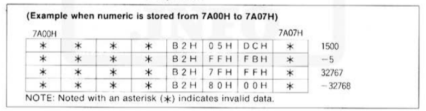
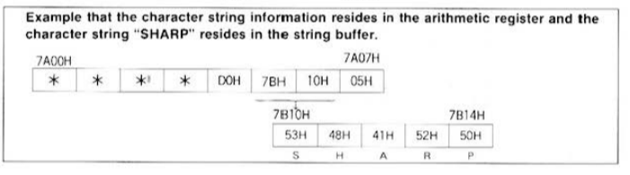
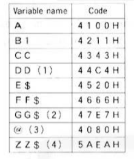
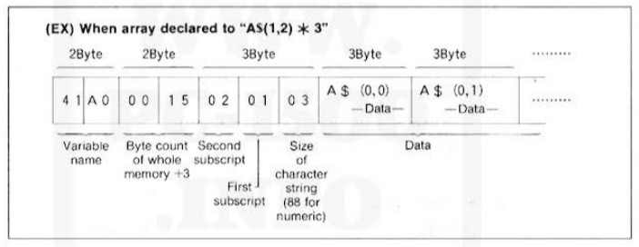
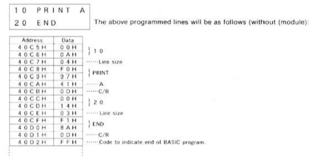

# Expression of Variables and Programs

## Expression of Decimal Numbers

Decimal numbers are represented using 8 bytes to accommodate values within the range:
   \[-9.999999999 \times 10^{99}, + 9.999999999 \times 10^{99}\]

### Byte Structure

- **1st Byte**: Exponent (binary format, can be negative)
- **2nd Byte**: Mantissa sign (00H for positive, 80H for negative)
- **3rd to 7th Bytes**: Mantissa value within \[-9.999999999, + 9.999999999\]
- **8th Byte**: Reserved (always 00H)

---

## Expression of Binary Numbers

Binary numbers use 8 bytes, though only 3 bytes are active (5th, 6th, and 7th) within the range:
   \[-32768, +32767\]

### Byte Structure

- **5th Byte**: Reserved (B2H)
- **6th to 7th Bytes**: Binary number value
- **1st to 4th, 8th Bytes**: Invalid data

---

## Expression of Character Strings

Character string information is composed of 8 bytes, where only 4 bytes are used. The character string information resides in the address specified.

### Byte Structure

- **5th Byte**: Reserved (D0H)
- **6th to 7th Bytes**: Leading address (0000H to FFFFH)
- **8th Byte**: Size of the string (01H to 50H)
- **1st to 4th Bytes**: Invalid data

---

## Structure of Variable Names

Variable names consist of two bytes representing 2 ASCII characters and contain bits to distinguish between numeric and non-numeric variables, with support for array assignments.

### Bit Structure

- **1st to 8th bits**: First ASCII character
- **9th bit**: Array assignment (1 for arrays, 0 otherwise)
- **10th bit**: 7th bit of the ASCII code (least significant byte)
- **11th bit**: Indicates if the variable is numeric (0) or non-numeric (1)
- **12th to 16th bits**: Second ASCII character (low-order bits)

---

## Structure of Program Lines

Each line in the program consists of a line number, line size, code, and an end code (0DH).

### Byte Structure

- **2 Bytes**: Line number
- **1 Byte**: Line size
- **Variable Bytes**: Program code
- **1 Byte**: End code (0DH)

---

## Structure of Reserved Area

